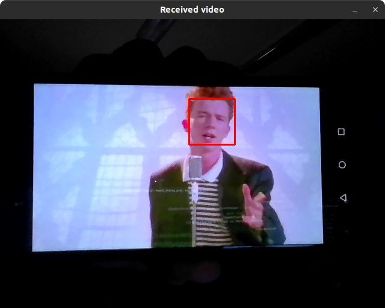

# Video over UDP sockets
## Installing dependencies
`sudo pip3 install opencv-python numpy`
## Running
Just run `python3 server.py` to start the server.
## Results
### Python
Run `python3 client.py` to start the client.
 

 
You can press Q to exit.
### Java

